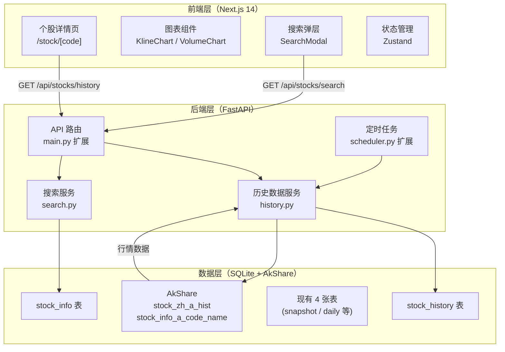

# A股个股历史走势分析工具 — 技术架构文档

> **文档版本**：v1.0
> **配套 PRD**：`2026-06-17-stock-history-chart-prd.md`
> **编写日期**：2026-06-17
> **状态**：待评审

---

## 1. 系统架构总览

### 1.1 架构分层图



### 1.2 新增文件清单

```
backend/app/
    ├── history.py          # 新增：历史行情拉取、聚合、缓存
    ├── search.py            # 新增：股票搜索服务
    ├── main.py              # 修改：新增 2 个路由（history / search）
    ├── storage.py           # 修改：新增 2 张表（stock_history / stock_info）
    └── scheduler.py         # 修改：新增缓存预热定时任务

frontend/app/
    ├── stock/
    │   └── [code]/
    │       └── page.tsx     # 新增：个股详情页（主入口）
    ├── components/
    │   ├── KlineChart.tsx   # 新增：K线主图（lightweight-charts）
    │   ├── VolumeChart.tsx  # 新增：成交量副图
    │   ├── StockHeader.tsx  # 新增：个股头部信息栏
    │   ├── StockToolbar.tsx # 新增：周期/复权/均线切换工具栏
    │   ├── StatsPanel.tsx   # 新增：区间统计面板
    │   ├── SearchModal.tsx  # 新增：搜索弹层
    │   ├── WatchlistBtn.tsx # 新增：收藏按钮
    │   └── ErrorCard.tsx    # 新增：统一错误状态卡片
    ├── hooks/
    │   ├── useStockHistory.ts   # 新增：历史数据请求 hook
    │   ├── useSearch.ts         # 新增：搜索请求 hook
    │   └── useWatchlist.ts      # 新增：自选股 localStorage hook
    ├── store/
    │   └── watchlist.ts         # 新增：Zustand 自选股状态
    └── styles/
        └── stock.module.css     # 新增：个股页面专属样式（可选，复用 styles.css）

backend/tests/
    ├── test_history.py     # 新增：历史数据服务单元测试
    └── test_search.py       # 新增：搜索服务单元测试
```

---

## 2. 后端详细设计

### 2.1 history.py — 历史数据服务

```python
# backend/app/history.py

from dataclasses import dataclass
from datetime import date, timedelta
from enum import Enum
from typing import Literal

import akshare as ak
import pandas as pd

Period = Literal["daily", "weekly", "monthly"]
Adjust = Literal["qfq", "none"]


class HistoryError(Enum):
    INVALID_CODE = ("INVALID_CODE", 400, "股票代码格式错误，应为6位数字")
    STOCK_NOT_FOUND = ("STOCK_NOT_FOUND", 404, "未找到该股票，可能代码错误或已退市")
    FETCH_TIMEOUT = ("FETCH_TIMEOUT", 408, "数据源请求超时，请稍后重试")
    RATE_LIMITED = ("RATE_LIMITED", 429, "请求过于频繁，请30秒后再试")
    INTERNAL_ERROR = ("INTERNAL_ERROR", 500, "服务器内部错误")


@dataclass
class HistoryResult:
    code: str
    name: str
    period: Period
    adjust: Adjust
    start_date: str
    end_date: str
    total_count: int
    latest_close: float
    latest_change_pct: float
    candles: list[dict]
    source: str = "akshare"


def _date_range(period: Period) -> tuple[str, str]:
    """根据周期自动计算回溯起始日期"""
    end = date.today().isoformat()
    if period == "daily":
        start = (date.today() - timedelta(days=365 * 3)).isoformat()
    elif period == "weekly":
        start = (date.today() - timedelta(days=365 * 5)).isoformat()
    else:  # monthly
        start = (date.today() - timedelta(days=365 * 10)).isoformat()
    return start, end


def _validate_code(code: str) -> str:
    """校验并规范化股票代码"""
    code = code.strip()
    if not (code.isdigit() and len(code) == 6):
        raise HistoryError.INVALID_CODE
    return code


def _normalize_columns(df: pd.DataFrame) -> pd.DataFrame:
    """将 AkShare 返回的 DataFrame 列名标准化"""
    column_map = {
        "日期": "trade_date",
        "开盘": "open",
        "最高": "high",
        "最低": "low",
        "收盘": "close",
        "成交量": "volume",
        "成交额": "amount",
        "换手率": "turnover",
    }
    # 兼容不同版本 AkShare 的列名（有/无"日期"列的情况）
    available = {k: v for k, v in column_map.items() if k in df.columns}
    return df.rename(columns=available)


def _fetch_from_akshare(code: str, period: Period, adjust: Adjust, start: str, end: str) -> pd.DataFrame:
    """从 AkShare 拉取原始数据"""
    symbol = f"{'sh' if code.startswith(('6', '5')) else 'sz'}{code}"
    adjust_map = {"qfq": "qfq", "none": ""}

    df = ak.stock_zh_a_hist(
        symbol=code,           # AkShare 新版用 code，老版用 symbol
        start_date=start.replace("-", ""),
        end_date=end.replace("-", ""),
        period=period,
        adjust=adjust_map[adjust],
    )
    return _normalize_columns(df)


def fetch_history(
    code: str,
    period: Period = "daily",
    adjust: Adjust = "qfq",
    start: str | None = None,
    end: str | None = None,
) -> HistoryResult:
    """
    主入口：从缓存或 AkShare 获取个股历史数据

    策略：
    1. 先查 SQLite 缓存（命中则直接返回）
    2. 未命中则调 AkShare，存入缓存后返回
    3. AkShare 调用加全局锁，防止并发触发限频
    """
    code = _validate_code(code)
    if start is None or end is None:
        start, end = _date_range(period)

    # TODO: 实现缓存查询逻辑（storage.py 提供方法）
    cached = _read_from_cache(code, period, adjust, start, end)
    if cached is not None:
        return cached

    # 加全局锁防止 AkShare 限频
    with _akshare_lock:
        try:
            df = _fetch_from_akshare(code, period, adjust, start, end)
        except ak.AkShareError as e:
            if "not found" in str(e).lower():
                raise HistoryError.STOCK_NOT_FOUND
            raise HistoryError.RATE_LIMITED

    if df.empty:
        raise HistoryError.STOCK_NOT_FOUND

    # 转换为 HistoryResult
    candles = df[["trade_date", "open", "high", "low", "close", "volume"]].to_dict(orient="records")
    latest = df.iloc[-1]
    name = _get_stock_name(code)  # 从 stock_info 表查名称

    result = HistoryResult(
        code=code,
        name=name or code,
        period=period,
        adjust=adjust,
        start_date=start,
        end_date=end,
        total_count=len(candles),
        latest_close=float(latest["close"]),
        latest_change_pct=float(latest.get("涨跌幅", 0)),
        candles=candles,
    )

    # 存入缓存
    _save_to_cache(result)

    return result


# --- 全局锁（防止 AkShare 并发请求触发限频）---
_akshare_lock: threading.Lock = threading.Lock()
```

### 2.2 search.py — 搜索服务

```python
# backend/app/search.py

from dataclasses import dataclass


@dataclass
class SearchResult:
    code: str
    name: str
    market: str  # 'sh' / 'sz'


def search_stocks(q: str, limit: int = 10) -> list[SearchResult]:
    """
    在 SQLite stock_info 表中搜索股票

    支持：
    - 精确代码搜索：'600519'
    - 名称模糊搜索：'茅台'
    """
    if not q or len(q) < 1:
        return []

    q_upper = q.upper()
    with _get_connection() as conn:
        rows = conn.execute(
            """
            SELECT code, name, market
            FROM stock_info
            WHERE code = ? OR name LIKE ? OR name_pinyin LIKE ?
            ORDER BY
                CASE WHEN code = ? THEN 0 ELSE 1 END,
                code ASC
            LIMIT ?
            """,
            (q, f"%{q}%", f"%{q_upper}%", q, limit)
        ).fetchall()

    return [SearchResult(code=r["code"], name=r["name"], market=r["market"]) for r in rows]
```

### 2.3 storage.py — 数据库变更

**新增表 1：stock_history**

```sql
CREATE TABLE IF NOT EXISTS stock_history (
    code        TEXT    NOT NULL,
    period      TEXT    NOT NULL,
    adjust      TEXT    NOT NULL,
    trade_date  TEXT    NOT NULL,
    open        REAL    NOT NULL,
    high        REAL    NOT NULL,
    low         REAL    NOT NULL,
    close       REAL    NOT NULL,
    volume      INTEGER NOT NULL,
    amount      REAL    NOT NULL,
    turnover    REAL    NOT NULL,
    updated_at  TEXT    NOT NULL,
    source      TEXT    NOT NULL,
    PRIMARY KEY (code, period, adjust, trade_date)
);

CREATE INDEX IF NOT EXISTS idx_history_lookup
    ON stock_history(code, period, adjust, trade_date DESC);
```

**新增表 2：stock_info**

```sql
CREATE TABLE IF NOT EXISTS stock_info (
    code        TEXT    PRIMARY KEY,
    name        TEXT    NOT NULL,
    market      TEXT    NOT NULL,
    list_date   TEXT    NOT NULL,
    name_pinyin TEXT    NOT NULL,    -- 全拼+首字母混合索引，加速拼音搜索
    updated_at  TEXT    NOT NULL
);

CREATE INDEX IF NOT EXISTS idx_info_name ON stock_info(name);
```

### 2.4 main.py — API 路由变更

**新增路由**：

```python
# backend/app/main.py（新增部分）

from app.history import fetch_history, HistoryError
from app.search import search_stocks


@app.get("/api/stocks/history")
def get_stock_history(
    code: str,
    period: str = "daily",
    adjust: str = "qfq",
    start: str | None = None,
    end: str | None = None,
):
    """获取个股历史行情"""
    try:
        result = fetch_history(
            code=code,
            period=period,    # Literal: "daily" | "weekly" | "monthly"
            adjust=adjust,    # Literal: "qfq" | "none"
            start=start,
            end=end,
        )
        return envelope(result, datetime.now().isoformat(), "akshare")
    except HistoryError as e:
        raise HTTPException(status_code=e.value[1], detail={"code": e.value[0], "message": e.value[2]})


@app.get("/api/stocks/search")
def search_stocks_api(q: str, limit: int = 10):
    """股票代码/名称搜索"""
    results = search_stocks(q=q, limit=limit)
    return envelope({"items": results, "total": len(results)}, datetime.now().isoformat(), "akshare")
```

---

## 3. 前端详细设计

### 3.1 路由结构

```
frontend/app/
├── page.tsx                    # 首页（已有：强势 Top20）
├── stock/
│   └── [code]/
│       └── page.tsx            # 新增：个股详情页（核心新页面）
└── layout.tsx                  # 修改：顶部导航增加搜索入口
```

**Next.js 动态路由**：`/stock/[code]` 接收 6 位股票代码作为参数，与 `page.tsx` 中的 `params.code` 对应。

### 3.2 useStockHistory Hook

```typescript
// frontend/hooks/useStockHistory.ts

import { useState, useEffect, useCallback } from "react";

type Period = "daily" | "weekly" | "monthly";
type Adjust = "qfq" | "none";

interface HistoryResponse {
  data: {
    code: string;
    name: string;
    period: Period;
    adjust: Adjust;
    meta: { start_date: string; end_date: string; total_count: number; latest_close: number; latest_change_pct: number; };
    candles: Array<{ time: string; open: number; high: number; low: number; close: number; volume: number; }>;
  };
  updated_at: string;
  source: string;
  risk_disclaimer: string;
}

interface UseStockHistoryReturn {
  data: HistoryResponse["data"] | null;
  loading: boolean;
  error: string | null;
  refetch: () => void;
}

export function useStockHistory(
  code: string,
  period: Period = "daily",
  adjust: Adjust = "qfq"
): UseStockHistoryReturn {
  const [data, setData] = useState<HistoryResponse["data"] | null>(null);
  const [loading, setLoading] = useState(false);
  const [error, setError] = useState<string | null>(null);
  const [tick, setTick] = useState(0);

  const refetch = useCallback(() => setTick((t) => t + 1), []);

  useEffect(() => {
    if (!code) return;
    setLoading(true);
    setError(null);

    const controller = new AbortController();
    const timeout = setTimeout(() => controller.abort(), 60_000);

    const url = `${API_BASE}/api/stocks/history?code=${code}&period=${period}&adjust=${adjust}`;

    fetch(url, { signal: controller.signal })
      .then((res) => {
        if (!res.ok) return res.json().then((e) => Promise.reject(e));
        return res.json();
      })
      .then((json: HistoryResponse) => {
        setData(json.data);
      })
      .catch((err) => {
        if (err.name === "AbortError") {
          setError("数据获取超时，请检查网络后重试");
        } else if (err.detail?.code === "STOCK_NOT_FOUND") {
          setError(`未找到股票 ${code}，请检查代码是否正确`);
        } else {
          setError("加载失败，请重试");
        }
      })
      .finally(() => {
        clearTimeout(timeout);
        setLoading(false);
      });

    return () => controller.abort();
  }, [code, period, adjust, tick]);

  return { data, loading, error, refetch };
}
```

### 3.3 均线计算模块

```typescript
// frontend/utils/ma.ts

export type MALine = { time: string; value: number };

export type MAVariants = {
  ma5: MALine[];
  ma10: MALine[];
  ma20: MALine[];
  ma60: MALine[];
};

/**
 * 从 K 线数据计算均线
 * @param candles - K 线数据（已按时间升序）
 * @param period - 均线周期（5/10/20/60）
 */
export function calcMA(candles: Array<{ time: string; close: number }>, period: number): MALine[] {
  const result: MALine[] = [];
  for (let i = period - 1; i < candles.length; i++) {
    const slice = candles.slice(i - period + 1, i + 1);
    const avg = slice.reduce((sum, c) => sum + c.close, 0) / period;
    result.push({ time: candles[i].time, value: parseFloat(avg.toFixed(2)) });
  }
  return result;
}

/**
 * 从 K 线数组计算所有均线
 */
export function calcAllMA(
  candles: Array<{ time: string; close: number }>
): MAVariants {
  return {
    ma5: calcMA(candles, 5),
    ma10: calcMA(candles, 10),
    ma20: calcMA(candles, 20),
    ma60: calcMA(candles, 60),
  };
}
```

### 3.4 KlineChart 组件（核心）

```typescript
// frontend/components/KlineChart.tsx

"use client";

import { useEffect, useRef, useMemo } from "react";
import { createChart, IChartApi, ISeriesApi, CandlestickData, LineData, CrosshairMode } from "lightweight-charts";
import { calcAllMA } from "@/utils/ma";

interface KlineChartProps {
  candles: Array<{ time: string; open: number; high: number; low: number; close: number; volume: number }>;
  showMA: { ma5: boolean; ma10: boolean; ma20: boolean; ma60: boolean };
}

const MA_COLORS = {
  ma5: "#ffffff",
  ma10: "#f6c85f",
  ma20: "#a855f7",
  ma60: "#39d98a",
} as const;

export default function KlineChart({ candles, showMA }: KlineChartProps) {
  const containerRef = useRef<HTMLDivElement>(null);
  const chartRef = useRef<IChartApi | null>(null);
  const seriesRef = useRef<ISeriesApi<"Candlestick"> | null>(null);
  const maSeriesRef = useRef<Record<string, ISeriesApi<"Line"> | null>>({});

  // 初始化图表
  useEffect(() => {
    if (!containerRef.current) return;
    const chart = createChart(containerRef.current, {
      layout: {
        background: { color: "#090d12" },
        textColor: "#8aa0b8",
      },
      grid: {
        vertLines: { color: "rgba(116, 156, 190, 0.15)" },
        horzLines: { color: "rgba(116, 156, 190, 0.15)" },
      },
      crosshair: {
        mode: CrosshairMode.Normal,
        vertLine: { color: "rgba(83, 214, 232, 0.5)", labelBackgroundColor: "#53d6e8" },
        horzLine: { color: "rgba(83, 214, 232, 0.5)", labelBackgroundColor: "#53d6e8" },
      },
      timeScale: {
        borderColor: "rgba(116, 156, 190, 0.22)",
        timeVisible: true,
        secondsVisible: false,
      },
      rightPriceScale: {
        borderColor: "rgba(116, 156, 190, 0.22)",
      },
      height: 420,
    });

    // 主 K 线系列
    const candleSeries = chart.addCandlestickSeries({
      upColor: "#ff5f5a",
      downColor: "#39d98a",
      borderUpColor: "#ff5f5a",
      borderDownColor: "#39d98a",
      wickUpColor: "#ff5f5a",
      wickDownColor: "#39d98a",
    });

    // 均线系列（提前创建，根据 showMA 控制显隐）
    const maSeries: Record<string, ISeriesApi<"Line"> | null> = {
      ma5: chart.addLineSeries({ color: MA_COLORS.ma5, title: "MA5", lineWidth: 1 }),
      ma10: chart.addLineSeries({ color: MA_COLORS.ma10, title: "MA10", lineWidth: 1 }),
      ma20: chart.addLineSeries({ color: MA_COLORS.ma20, title: "MA20", lineWidth: 1 }),
      ma60: chart.addLineSeries({ color: MA_COLORS.ma60, title: "MA60", lineWidth: 1 }),
    };

    chartRef.current = chart;
    seriesRef.current = candleSeries;
    maSeriesRef.current = maSeries;

    // 响应式
    const resizeObserver = new ResizeObserver((entries) => {
      const { width } = entries[0].contentRect;
      chart.applyOptions({ width: Math.max(width, 320) });
    });
    resizeObserver.observe(containerRef.current);

    return () => {
      resizeObserver.disconnect();
      chart.remove();
    };
  }, []);

  // 更新 K 线数据
  useEffect(() => {
    if (!seriesRef.current || !candles.length) return;

    const formatted: CandlestickData[] = candles.map((c) => ({
      time: c.time as any, // lightweight-charts 支持 YYYY-MM-DD 字符串
      open: c.open,
      high: c.high,
      low: c.low,
      close: c.close,
    }));

    seriesRef.current.setData(formatted);
    chartRef.current?.timeScale().fitContent(); // 自动缩放到所有数据
  }, [candles]);

  // 更新均线数据
  useEffect(() => {
    if (!candles.length) return;

    const maData = calcAllMA(candles);

    for (const [key, series] of Object.entries(maSeriesRef.current)) {
      if (!series) continue;
      const shouldShow = showMA[key as keyof typeof showMA];
      if (shouldShow && maData[key as keyof typeof maData].length > 0) {
        const lineData: LineData[] = maData[key as keyof typeof maData].map((m) => ({
          time: m.time as any,
          value: m.value,
        }));
        series.setData(lineData);
        series.applyOptions({ visible: true });
      } else {
        series.setData([]);
        series.applyOptions({ visible: false });
      }
    }
  }, [candles, showMA]);

  return <div ref={containerRef} style={{ width: "100%", height: 420 }} />;
}
```

### 3.5 useWatchlist Zustand Store

```typescript
// frontend/store/watchlist.ts

import { create } from "zustand";
import { persist } from "zustand/middleware";

interface WatchlistItem {
  code: string;
  name: string;
  addedAt: string;
}

interface WatchlistState {
  items: WatchlistItem[];
  add: (code: string, name: string) => void;
  remove: (code: string) => void;
  has: (code: string) => boolean;
}

export const useWatchlistStore = create<WatchlistState>()(
  persist(
    (set, get) => ({
      items: [],

      add: (code, name) => {
        if (get().has(code)) return;
        set((s) => ({
          items: [
            ...s.items,
            { code, name, addedAt: new Date().toISOString().split("T")[0] },
          ],
        }));
      },

      remove: (code) => {
        set((s) => ({ items: s.items.filter((i) => i.code !== code) }));
      },

      has: (code) => get().items.some((i) => i.code === code),
    }),
    {
      name: "market-watch-watchlist", // localStorage key
    }
  )
);
```

---

## 4. 定时任务设计

### 4.1 每日缓存预热

**任务 1：日线每日补数**（与现有 15:30 刷新任务合并）

```python
# backend/app/scheduler.py（扩展）

def setup_scheduler(store: MarketStore) -> None:
    from app.history import refresh_history_cache

    # === 现有任务：每日收盘后刷新快照 ===
    scheduler.add_job(
        refresh_market,
        trigger=CronTrigger(day_of_week="mon-fri", hour=15, minute=30, timezone="Asia/Shanghai"),
        args=[store],
        id="daily_snapshot_refresh",
        name="每日行情快照刷新",
    )

    # === 新增：日线历史缓存每日补数 ===
    # 逻辑：从 stock_info 表取所有 A 股代码，按"今日新产生一根 K 线"逻辑，
    #       只追加今日数据（量小，不会触发限频）
    scheduler.add_job(
        refresh_history_cache,
        trigger=CronTrigger(day_of_week="mon-fri", hour=15, minute=35, timezone="Asia/Shanghai"),
        id="daily_history_cache_refresh",
        name="每日历史缓存补数",
    )

    # === 新增：每周一预热上周周线 ===
    scheduler.add_job(
        lambda: refresh_history_cache(period="weekly"),
        trigger=CronTrigger(day_of_week="mon", hour=16, minute=0, timezone="Asia/Shanghai"),
        id="weekly_history_cache_refresh",
        name="周线缓存刷新（每周一）",
    )

    # === 新增：每月末预热上月月线 ===
    scheduler.add_job(
        lambda: refresh_history_cache(period="monthly"),
        trigger=CronTrigger(day="last", hour=16, minute=30, timezone="Asia/Shanghai"),
        id="monthly_history_cache_refresh",
        name="月线缓存刷新（每月末）",
    )

    # === 新增：每日凌晨同步全市场股票列表 ===
    scheduler.add_job(
        sync_stock_info,
        trigger=CronTrigger(hour=3, minute=0, timezone="Asia/Shanghai"),
        id="daily_stock_info_sync",
        name="全市场股票列表同步（每日凌晨）",
    )
```

---

## 5. 错误处理策略

### 5.1 后端错误分类与 HTTP 映射

| HistoryError 枚举 | HTTP 状态码 | 错误码字符串 | 前端处理 |
|------------------|------------|------------|---------|
| `INVALID_CODE` | 400 | `INVALID_CODE` | 弹窗提示"代码格式错误" |
| `STOCK_NOT_FOUND` | 404 | `STOCK_NOT_FOUND` | 显示错误卡片 |
| `FETCH_TIMEOUT` | 408 | `FETCH_TIMEOUT` | 显示超时提示 + 重试按钮 |
| `RATE_LIMITED` | 429 | `RATE_LIMITED` | 自动 30 秒后重试 |
| `INTERNAL_ERROR` | 500 | `INTERNAL_ERROR` | 错误日志 + 友好提示 |

### 5.2 前端错误边界

```typescript
// 个股详情页整体错误边界
function StockPageErrorBoundary({ children }: { children: React.ReactNode }) {
  return (
    <ErrorBoundary
      fallback={
        <div className="error-card">
          <AlertTriangle size={48} />
          <h2>加载失败</h2>
          <p>{error?.message || "发生未知错误"}</p>
          <div className="actions">
            <button onClick={() => reset()}>重新加载</button>
            <Link href="/">返回首页</Link>
          </div>
        </div>
      }
    >
      {children}
    </ErrorBoundary>
  );
}
```

---

## 6. 性能优化策略

### 6.1 前端性能

| 策略 | 说明 |
|------|------|
| 图表数据懒计算 | MA 均线在 `useMemo` 中计算，依赖 K 线数组 `candles` 变化时才重算 |
| React.memo 包裹 | `KlineChart` / `VolumeChart` 用 `React.memo` 避免父组件重渲染导致图表重建 |
| 图表 resize 用 ResizeObserver | 不依赖 window.resize，避免性能浪费 |
| 均线 show/hide 用 `setData([])` 而不是销毁重建 | lightweight-charts 支持 `visible: false` + `setData([])`，性能更优 |

### 6.2 后端性能

| 策略 | 说明 |
|------|------|
| AkShare 全局锁 | `threading.Lock()` 防止并发请求同一接口触发 429 |
| SQLite 复合主键 | `(code, period, adjust, trade_date)` 确保缓存唯一性 |
| 索引覆盖 | `idx_history_lookup` 索引覆盖 `ORDER BY trade_date DESC`，查询 < 200ms |
| 搜索全表预加载 | `stock_info` 每日凌晨同步一次（~5000 条），启动时全部加载到内存 dict，O(1) 查询 |

---

## 7. 安全与合规

| 项目 | 策略 |
|------|------|
| 无用户数据 | 纯本地工具，无登录，无用户数据存储 |
| 外部网络请求 | 仅访问 AkShare（新浪财经数据源），不出站其他地址 |
| CORS | 仅允许 `http://localhost:3000` 和 `http://127.0.0.1:3000`（沿用现有配置） |
| 数据来源标注 | 所有接口响应含 `source: "akshare"` 和 `risk_disclaimer` |
| 防爬 | AkShare 本身已有频率限制；全局锁防止应用层并发触发 |

---

## 8. 测试策略

### 8.1 后端测试

```python
# backend/tests/test_history.py

class TestHistoryService:
    def test_validate_code_accepts_6digit(self):
        assert _validate_code("600519") == "600519"

    def test_validate_code_rejects_short(self):
        with pytest.raises(HistoryError.INVALID_CODE):
            _validate_code("60051")

    def test_normalize_columns_maps_chinese_headers(self):
        df = pd.DataFrame({
            "日期": ["2026-01-01"],
            "开盘": [100.0],
            "最高": [105.0],
            "最低": [99.0],
            "收盘": [103.0],
            "成交量": [10000],
        })
        normalized = _normalize_columns(df)
        assert "trade_date" in normalized.columns
        assert "close" in normalized.columns

    def test_date_range_daily_returns_3_years(self):
        start, end = _date_range("daily")
        assert (date.today() - parse(start)).days in [365 * 3 - 5, 365 * 3]
```

### 8.2 前端测试（Vitest）

```typescript
// frontend/utils/__tests__/ma.test.ts

import { describe, it, expect } from "vitest";
import { calcMA, calcAllMA } from "../ma";

describe("MA 计算", () => {
  const candles = [
    { time: "2026-01-01", close: 100 },
    { time: "2026-01-02", close: 102 },
    { time: "2026-01-03", close: 101 },
    { time: "2026-01-06", close: 103 },
    { time: "2026-01-07", close: 105 },
    { time: "2026-01-08", close: 107 },
    { time: "2026-01-09", close: 106 },
  ];

  it("MA5 第一根均线对应第5个交易日", () => {
    const ma5 = calcMA(candles, 5);
    expect(ma5.length).toBe(3); // 7天数据，MA5需要5天预热，产出3根
    expect(ma5[0].value).toBeCloseTo(101.4); // (100+102+101+103+105)/5
  });

  it("MA10 数据不足时返回空数组", () => {
    const ma10 = calcMA(candles, 10);
    expect(ma10.length).toBe(0);
  });
});
```

---

*文档结束。本文档与 PRD 配套，作为开发工程师的唯一实现依据。如有架构变更，需同步更新本文件。*
